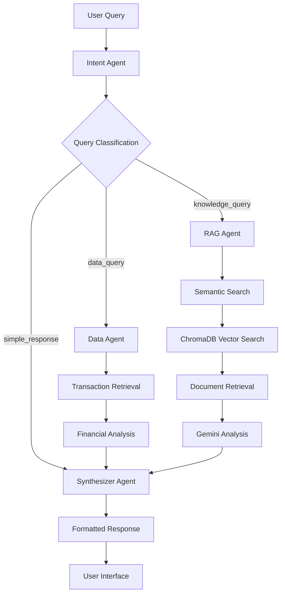

# 🤖 AI Financial Assistant

A sophisticated multi-agent AI system for financial analysis and insights, built with **FastAPI**, **React**, **ChromaDB**, and **Google Gemini**. Features intelligent query routing, semantic search with sentence-transformers, and beautiful conversational responses.


## 🎥 **Demo Video**

Watch our AI Financial Assistant in action! See the multi-agent system, beautiful UI, and intelligent responses:

[](https://youtu.be/v1EqgdQjCKM)

> **🎬 Video Highlights:**
> - Multi-agent workflow demonstration
> - Real-time query processing and routing
> - Beautiful response formatting
> - User switching and data isolation
> - AI Dashboard features and analytics
> - Semantic search with RAG capabilities

## 🎯 **Features**

- **🧠 Multi-Agent Architecture**: Intent classification, data processing, RAG-based knowledge retrieval
- **🔍 Semantic Search**: sentence-transformers/all-MiniLM-L6-v2 for intelligent document retrieval
- **💾 Vector Database**: ChromaDB for efficient similarity search
- **🎨 Beautiful UI**: Modern React frontend with shadcn/ui components
- **👥 Multi-User Support**: User-specific data isolation and switching
- **⚡ Real-time Responses**: Fast query processing with detailed performance metrics
- **📊 Smart Analytics**: Automated financial insights and pattern recognition

## 🏗️ **Multi-Agent Architecture**

Our system uses a sophisticated multi-agent workflow inspired by LangGraph patterns:



### **🤖 Agent Responsibilities**

#### **1. Intent Agent** (`agents/intent_agent.py`)
- **Purpose**: Classifies user queries and creates structured plans
- **Technology**: Google Gemini 2.5 Flash
- **Classifications**:
  - `simple_response`: Greetings, basic questions
  - `data_query`: Structured financial calculations
  - `knowledge_query`: Pattern analysis and insights

#### **2. Data Agent** (`agents/data_agent.py`)
- **Purpose**: Executes structured queries on transaction data
- **Operations**: `top_n`, `total`, `category_analysis`, `compare_max`
- **Features**: User-specific filtering, financial calculations

#### **3. RAG Agent** (`agents/rag_agent.py`)
- **Purpose**: Retrieval-Augmented Generation for knowledge queries
- **Technology**: sentence-transformers/all-MiniLM-L6-v2 + ChromaDB
- **Process**:
  1. Generate query embeddings (384-dimensional)
  2. Vector similarity search in ChromaDB
  3. Retrieve top 8 most relevant documents
  4. Gemini analysis for knowledge-rich responses

#### **4. Synthesizer Agent** (`agents/synthesizer_agent.py`)
- **Purpose**: Formats responses into beautiful, conversational text
- **Features**: Bold formatting, numbered lists, professional structure
- **Output**: Clean, readable responses without technical metadata

#### **5. Orchestrator** (`agents/orchestrator.py`)
- **Purpose**: Coordinates all agents and manages conversation flow
- **Features**: Memory management, routing logic, error handling

## 🚀 **Quick Start**

### **Prerequisites**
- Python 3.9+
- Node.js 16+
- Google Gemini API Key

### **1. Backend Setup**

```bash
# Clone and navigate
cd backend

# Install dependencies
pip install -r requirements.txt

# Configure environment
cp .env.example .env
# Add your GEMINI_API_KEY to .env

# Generate sample data and build index
python setup_and_run.py
```

### **2. Frontend Setup**

```bash
# Navigate to frontend
cd ../frontend

# Install dependencies
npm install

# Configure environment
cp .env.example .env
# Set VITE_API_URL=http://localhost:8000

# Start development server
npm run dev
```

## 🧪 **Testing the System**

### **Without Frontend (Backend Only)**

#### **1. Quick Agent Test**
```bash
cd backend
python test_agents.py
```

#### **2. Complete Workflow Test**
```bash
python testing/test_complete_workflow.py
```

#### **3. User Switching Test**
```bash
python test_user_switching.py
```

#### **4. RAG & Semantic Search Test**
```bash
python testing/test_sentence_transformers_rag.py
```

#### **5. API Endpoints Test**
```bash
# Health check
curl http://localhost:8000/health

# Generate sample data
curl -X POST http://localhost:8000/generate

# Build ChromaDB index
curl -X POST http://localhost:8000/index/build

# Test query
curl -X POST "http://localhost:8000/query" \
  -H "Content-Type: application/json" \
  -d '{"user_id": "user_001", "query": "my top 3 expenses"}'
```

### **With Frontend (Full Stack)**

#### **1. Start Both Servers**
```bash
# Terminal 1: Backend
cd backend && python setup_and_run.py

# Terminal 2: Frontend
cd frontend && npm run dev
```

#### **2. Test User Experience**
1. Open `http://localhost:5173` in browser
2. Switch between users (Alex Chen, Jordan Smith, Taylor Lee)
3. Try different query types:
   - **Simple**: "hello", "what can you do"
   - **Data**: "top 5 expenses", "how much on food"
   - **Knowledge**: "spending patterns", "unusual expenses"

#### **3. Verify Multi-Agent Flow**
- Check browser console for API calls
- Observe response formatting and timing
- Test user-specific data isolation

## 📊 **Sample Queries & Expected Responses**

### **Data Queries** (→ Data Agent)
```
Query: "my top 3 expenses"
Response:
Here are your top 3 expenses:

1. **₹16,969** for **Room rent** on 2025-09-21
2. **₹13,084** for **Ola Booking** on 2025-09-29
3. **₹4,899** for **Hotstar Payment** on 2025-10-02
```

### **Knowledge Queries** (→ RAG Agent)
```
Query: "what do I spend most on?"
Response:
Based on your transaction patterns, you spend most on **Food & Dining** (35.2% of expenses) with ₹12,500, followed by **Transportation** (28.1%) with ₹8,900. Your food expenses include frequent restaurant visits and regular grocery shopping.
```

### **Simple Responses** (→ Synthesizer Agent)
```
Query: "hello"
Response:
Hello! I'm your AI financial assistant. I can help you analyze expenses, track spending patterns, and provide insights about your financial data. What would you like to know?
```

## 🔧 **Configuration**

### **Backend Environment** (`.env`)
```env
GEMINI_API_KEY=your_gemini_api_key_here
GEMINI_MODEL=gemini-2.5-flash
CHROMA_DB_PATH=./chroma_db
DATA_FILE_PATH=data/transactions.json
EMBEDDING_MODEL=sentence-transformers/all-MiniLM-L6-v2
API_HOST=0.0.0.0
API_PORT=8000
```

### **Frontend Environment** (`.env`)
```env
VITE_API_URL=http://localhost:8000
VITE_GEMINI_API_KEY=your_gemini_api_key_here
```

## 📁 **Project Structure**

```
suvit/
├── backend/                    # FastAPI Backend
│   ├── agents/                # Multi-Agent System
│   │   ├── intent_agent.py    # Query classification
│   │   ├── data_agent.py      # Structured queries
│   │   ├── rag_agent.py       # Semantic search & RAG
│   │   ├── synthesizer_agent.py # Response formatting
│   │   └── orchestrator.py    # Agent coordination
│   ├── api/                   # FastAPI routes
│   ├── services/              # Core services
│   │   ├── embeddings.py      # sentence-transformers
│   │   └── memory.py          # Conversation memory
│   ├── nodes/                 # Data processing
│   │   ├── retriever.py       # ChromaDB interface
│   │   └── query_parser.py    # Query processing
│   ├── tools/                 # Financial analysis
│   ├── testing/               # Comprehensive tests
│   ├── chroma_db/             # Vector database
│   └── requirements.txt       # Python dependencies
├── frontend/                  # React Frontend
│   ├── src/
│   │   ├── components/        # UI components
│   │   ├── pages/             # Application pages
│   │   └── services/          # API integration
│   └── package.json           # Node dependencies
└── README.md                  # This file
```

## 🎨 **AI Dashboard**

The **AI Dashboard** (`/ai-dashboard`) provides a comprehensive financial overview:

### **Features**
- **📊 Interactive Charts**: Spending trends, category breakdowns
- **💰 KPI Cards**: Total expenses, income, savings
- **🧠 AI Insights Panel**: Automated financial insights
- **🔍 Smart Filters**: Dynamic data filtering
- **📱 Responsive Design**: Works on all devices

### **Dashboard Components**
- **Real-time Analytics**: Live financial metrics
- **Spending Patterns**: Visual trend analysis  
- **Category Insights**: Detailed expense breakdowns
- **Budget Tracking**: Goal vs actual spending
- **AI Recommendations**: Personalized financial advice

### **Access Dashboard**
1. Start the full stack system
2. Navigate to `http://localhost:5173/ai-dashboard`
3. Switch between users to see different data
4. Interact with charts and filters
5. Get AI-powered insights

## 🔍 **Technical Deep Dive**

### **Semantic Search with sentence-transformers**
- **Model**: `sentence-transformers/all-MiniLM-L6-v2`
- **Embedding Dimension**: 384
- **Similarity Metric**: Cosine similarity
- **Performance**: ~10ms query embedding generation

### **ChromaDB Vector Database**
- **Storage**: Persistent local storage
- **Collections**: User-specific transaction embeddings
- **Indexing**: Automatic HNSW indexing
- **Filtering**: User-based data isolation

### **Multi-User Architecture**
- **User IDs**: `user_001`, `user_002`, `user_003`
- **Data Isolation**: ChromaDB filtering by `userId`
- **Frontend Switching**: Dynamic user context
- **Backend Filtering**: Automatic user-specific queries

## 🚀 **Performance Metrics**

- **Simple Responses**: < 200ms
- **Data Queries**: 1-3 seconds
- **Knowledge Queries**: 2-4 seconds
- **Embedding Generation**: ~10ms
- **Vector Search**: ~50ms
- **Total System**: < 5 seconds end-to-end

## 🤝 **Contributing**

1. Fork the repository
2. Create feature branch (`git checkout -b feature/amazing-feature`)
3. Commit changes (`git commit -m 'Add amazing feature'`)
4. Push to branch (`git push origin feature/amazing-feature`)
5. Open Pull Request

## 📄 **License**

This project is licensed under the MIT License - see the [LICENSE](LICENSE) file for details.

## 🙏 **Acknowledgments**

- **Google Gemini**: Advanced language model capabilities
- **sentence-transformers**: Semantic embedding generation
- **ChromaDB**: Efficient vector database
- **FastAPI**: High-performance web framework
- **React**: Modern frontend framework
- **shadcn/ui**: Beautiful UI components

---

**Built with ❤️ by the AI Financial Assistant Team**

*Empowering smarter financial decisions through intelligent AI assistance*
